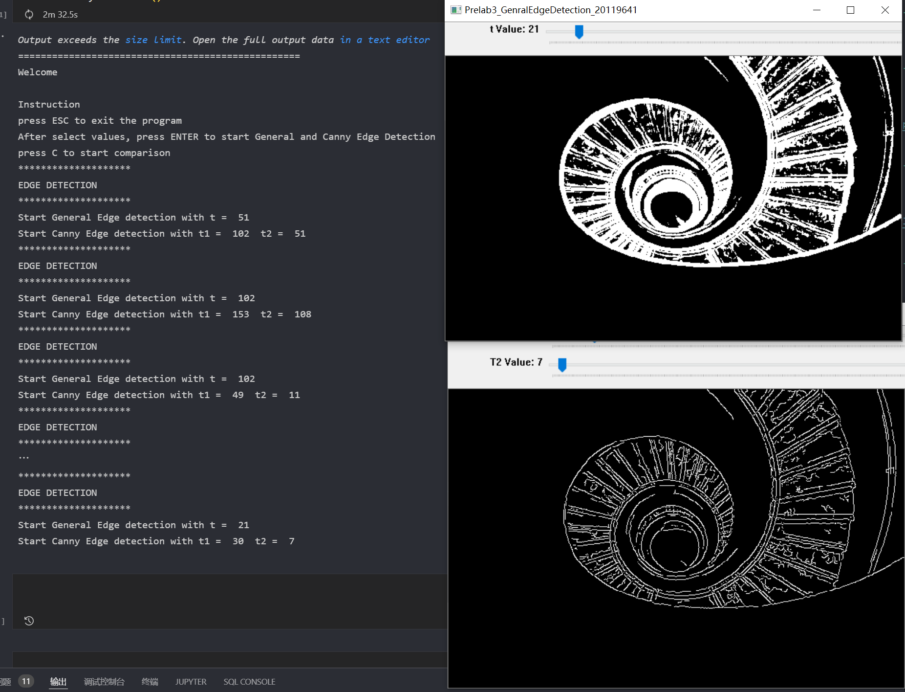

# ELEC474 Computer Vision Project

### Advisor: Michael Greenspan

## Course Note 

[(Notion Link)](https://mikevon.notion.site/ceb9888602d4429caaf5d23a5e23fbf4?v=945eda80104646499055b11516773829)

## Lab1 ---- OpenCV intro

Python with OpenCv, just check the code in the ./lab1

## Prelab2 ---- Flood Fill and Homogeneity criterion correct 

Original|   Tensity= 52|    Tensity= 103|
  --------| --------|--------|
 | ||

## Lab2 ---- K-Means and Color Quantization

Original|   K value = 2|     K value = 6|
  --------| --------|--------|
| ||

## Prelab3 ----- General and Canny Edge Detection

Original|   general t =  51, Canny t = [51， 102]|    general t =  21, Canny t = [30， 7]|
  --------| --------|--------|
| ||

## Lab3 ---- RANSAC
Implement different method for sorting and searching with different data structure. The best solution is ./lab3/Main_MikeFeng_20119641_Gresult_F.ipynb
Original|  With in 60s for 100000|
  --------| --------|
  |

## Prelab4 -- BFMatch with Lowe Ratio

------|   Original imgs |    ------|
  --------| --------|--------|
  |  |   |

 descriptors| Matches| General and low ratio|
--------|   --------| --------|
    |    |   

## Lab4 ---- Transformation Estimation

 descriptors| Affine Transform apply | Perspective Transform apply |
--------|   --------| --------|
   |   |  

## Prelab5 ---- Epipolar Geometry

Epipolar Calculation |  Point/Conjugate Epipolar Line Selection |
  --------| --------|
   |  

## Lab5 ---- Stereo Rectification and Block Matching Disparity Map Calculation

Stereo Rectification  original（l)  |  Stereo Rectification  |
  --------| --------|
   |  

Block matching original (l) |  Block matching |
  --------| --------|
  |  

## Project ---- Autostitch
The project has using the imgs in ./Project/offices2 

Detail can check the report as .docx file or ./Project/Deliverable/D2/Project_Report.pdf 

Stich version 1 |   Stich version 2 (best) |     Stich version 2 | Stich version 3 |
  --------| --------|--------| --------|
| |||
| |||
